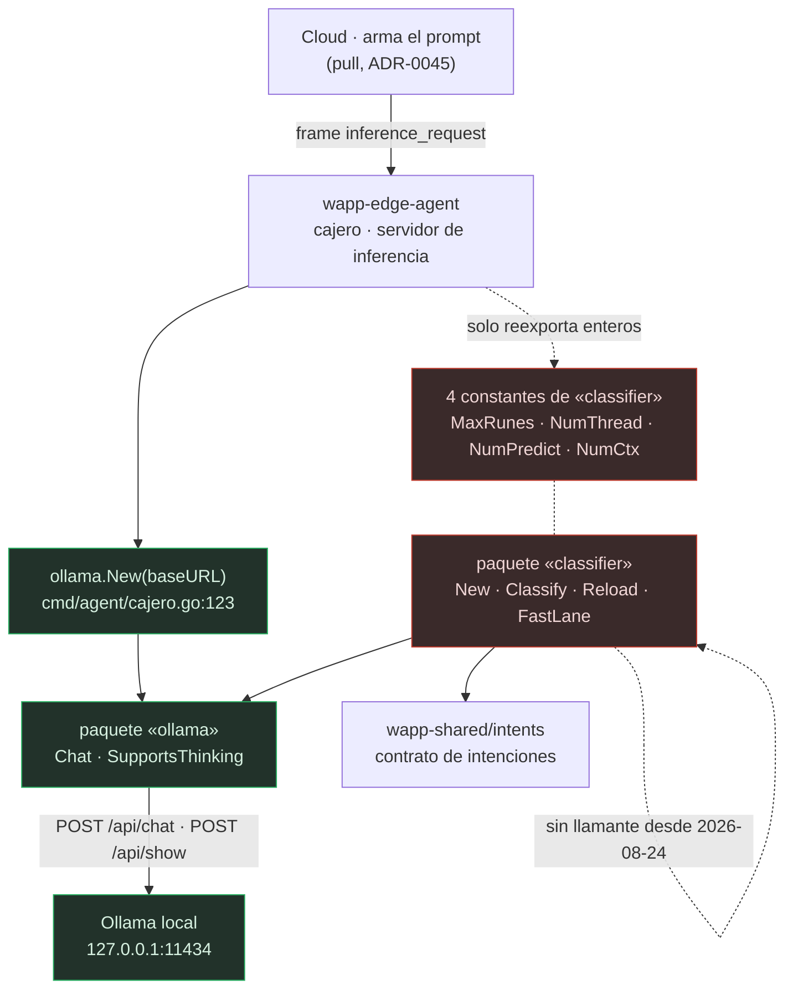

# Arquitectura de `wapp-edge-intent`

Cómo está hecha por dentro. Corto, porque la pieza es pequeña: **9 ficheros Go, 2.080 líneas**
(`wc -l classifier/*.go ollama/*.go`), **dos paquetes**, **ningún binario**.

---

## 1. Forma general

No es un servicio: es una **librería** que se compila **dentro** del binario del Edge Agent. No
arranca, no escucha, no persiste. Entra texto (o una petición de chat), sale una struct.

```
wapp-edge-intent/
  go.mod                     módulo Go; UNA dependencia externa
  Makefile                   los gates locales
  .golangci.yml              lint; declara build-tags: [ollama]
  .github/workflows/
    ci.yml                   workflow_dispatch — NO se dispara con push ni PR
    sync-main-to-dev.yml     el ÚNICO automático del repo (push a main → dev)
  ollama/                    🟢 EL PAQUETE VIVO
    client.go                345 líneas — cliente HTTP de la API REST local de Ollama
    client_test.go           300 líneas — 10 tests
  classifier/                🟠 HUÉRFANO desde el 2026-08-24 (solo sobreviven 4 constantes)
    classifier.go            390 — constantes calibradas, tipo Classifier, Classify, truncateRunes
    prompt.go                 69 — buildPrompt: regenera el prompt de sistema desde el contrato
    schema.go                 68 — buildSchema: el JSON Schema que fuerza la forma de la salida
    sanitize.go               39 — sanitizeParams: el allowlist semántico
    fastlane.go               43 — FastLane: descarta lo trivial sin gastar LLM
    classifier_test.go       674 — 20 tests
    battery_test.go          152 — TestBattery, tras //go:build ollama
    testdata/intents.json     82 — fixture: 10 intenciones, umbral 0.6, vocabulario de pizzería
```

---

## 2. Los dos paquetes, una frase cada uno

| Paquete | Qué es | Estado |
|---|---|---|
| **`ollama`** | Cliente HTTP mínimo de la API REST local de Ollama: `Chat` con salida forzada por JSON Schema, caché de capabilities por modelo, `ListModels`, `Health` y la traducción de métricas a unidades legibles. | 🟢 **El núcleo vivo.** Es lo único que el ecosistema consume de verdad. |
| **`classifier`** | El clasificador: construye prompt y schema desde el contrato de intenciones, llama al LLM, parsea, sanea los params contra el mensaje del cliente y aplica el umbral de confianza. | 🟠 **Huérfano.** Código correcto y bien probado, **sin llamante** desde el 2026-08-24. |

### Capas

Solo hay dos, y la dirección de dependencia es una sola flecha:

```
classifier  ──depende de──▶  ollama  ──HTTP──▶  127.0.0.1:11434
     │
     └──depende de──▶  wapp-shared/intents  (el contrato: tipos + validación)
```

`ollama` **no conoce** a `classifier`. Esa asimetría es la que permite que hoy el agente use el
cliente sin arrastrar el clasificador muerto… salvo que sí lo arrastra, porque importa cuatro
constantes que viven en `classifier` (ver §5).

---

## 3. Diagrama: qué corre de verdad hoy



Línea continua = camino ejecutado en producción. Línea punteada = enlace que existe en el grafo de
compilación pero **no ejecuta código**.

---

## 4. Flujo interno de `Classify` (el camino huérfano, documentado por si revive)

`classifier/classifier.go:264-333`, en orden:

1. **Lee bajo `RLock`** la terna `cfg`/`prompt`/`schema` (`:265-267`). `Reload` puede
   intercambiarlas en caliente sin cortar clasificaciones en vuelo.
2. **Recorta por runas** a `maxRunes` y marca `Truncado` (`:271`).
3. **Arma dos mensajes**: `system` (el prompt regenerado desde el contrato) y `user` (el texto
   recortado) (`:273-276`).
4. **`think:false` solo si el modelo tiene la capability** (`:281-285`). En qwen3 la cadena de
   pensamiento **triplica la latencia** sin mejorar el resultado de clasificar.
5. **Llama a `ollama.Chat`** con el schema como `format` (`:287-293`). 🔴 **No manda `keep_alive`**
   — ver `deuda.md`, D5.
6. **Parsea** en un tipo `wire` aparte (`:299`). JSON ilegible **no es error**: degrada a
   `"desconocido"` conservando métricas y `Truncado`.
7. **Sanea los params** contra el texto **truncado** (`:320`).
8. **Aplica el umbral** (`:328-331`): por debajo, `Intent = "desconocido"` y `Params = nil`.

`FastLane` (`classifier/fastlane.go:33`) es la puerta previa: devuelve `true` para texto vacío, un
número de 1–3 dígitos (opción de menú, voto de encuesta) y confirmaciones de una palabra
(`sí/no/ok/vale/dale/…`). Cuando devuelve `true`, el caller entrega el mensaje **sin intención**:
el Motor de Flujos del Cloud sabe si hay conversación viva que capture esa respuesta corta.

---

## 5. Puntos de entrada y binarios

**Este repo no produce ningún binario.** No hay `cmd/`, no hay `func main`
(`rg -n '^func main' .` → vacío). `make build` (`Makefile:8-9`) es `go build ./...`, que en un
módulo sin `package main` compila las librerías y **no deja artefacto**.

El punto de entrada real vive **fuera**, en el consumidor:

| Entrada | Dónde | Qué hace |
|---|---|---|
| `ollama.New(cfg.Intent.OllamaURL)` | `wapp-edge-agent/cmd/agent/cajero.go:123` | Construye el **único** cliente de Ollama del ecosistema. El agente lo custodia con un grep como gate (REQ-051.10, `wapp-edge-agent/cmd/agent/cajero.go:121-122`). |
| `Client.Chat` | `wapp-edge-agent/internal/app/cajero/servidor.go:393` | Cada inferencia que el Cloud pide. |
| `Client.SupportsThinking` | `wapp-edge-agent/internal/app/cajero/servidor.go:340` | Decide si mandar `think:false`. |
| Las 4 constantes | `wapp-edge-agent/internal/app/cajero/cajero.go:75-81` | Se reexportan; `wapp-edge-agent/internal/infra/config/config.go` las referencia desde ahí. |

⚠️ **Por qué las constantes se reexportan en el paquete `cajero` y no en `config`**: para no
arrastrar `ollama → net/http` al grafo de todo el que importe `config`, incluido el binario
`wapp-ctl` (`wapp-edge-agent/internal/app/cajero/cajero.go:60-73`). Si mueves esas constantes de
paquete aquí, rompes ese razonamiento allí.

---

## 6. Estado en memoria (no hay ningún otro)

Sin base de datos, sin migraciones, sin versión de esquema, sin ficheros en disco. El único estado
es **por proceso y en RAM**:

| Estado | Dónde | Protección | Nota |
|---|---|---|---|
| Caché modelo → capabilities | `ollama/client.go:29` | `sync.Mutex` (`ollama/client.go:28`) | 🔴 **Sin TTL ni invalidación.** Ver `deuda.md`, D2. |
| `cfg` / `prompt` / `schema` del clasificador | `classifier/classifier.go:173-176` | `sync.RWMutex` | Intercambiables en caliente por `Reload`. |
| `maxRunes` / `llmOpts` | `classifier/classifier.go:170-171` | ninguna, y no la necesita | Se fijan en `New` y **no se vuelven a escribir**: se leen sin lock a propósito. |

El contrato de intenciones (`intents.Config`) **se lo entrega el caller ya deserializado**: este
repo no sabe de dónde sale ni lo lee de disco. El `classifier/testdata/intents.json` es **solo**
material de test.

---

## 7. Lo que este repo deliberadamente NO tiene

Verificado con `rg -ni 'sello|sealed|firma|grpc|ConfigUpdate|entitlement|nacl|x25519|sql|migrat'`
sobre todo el código: **cero** coincidencias reales.

- **Sin gRPC.** El transporte edge↔cloud vive en `wapp-cloudlink`, no aquí.
- **Sin criptografía, sin DEK, sin Lease.** El zero-knowledge se cumple por vacío: aquí no hay
  credenciales ni llaves que proteger, y el gate del lease lo aplica el agente antes de llamar.
- **Sin `ConfigUpdate` ni entitlements.** Viven en `wapp-edge-agent` / `wapp-cloud-platform`.
- **Sin broker ni Redis.** La concurrencia se resuelve con `sync` y el `context` del llamante.
- **Sin UI.** No hay plantillas, ni CSS, ni JS: es una librería sin superficie visual.
